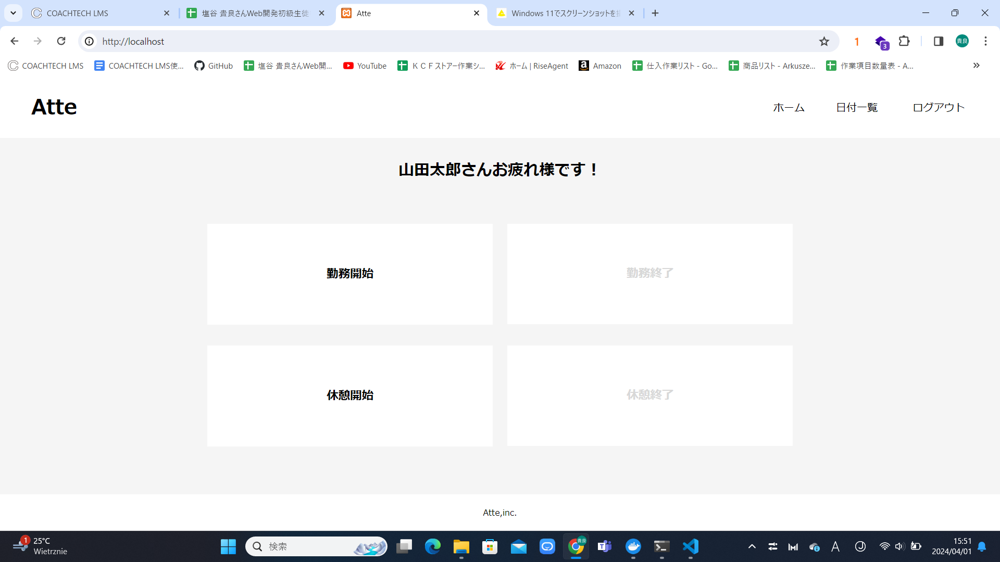
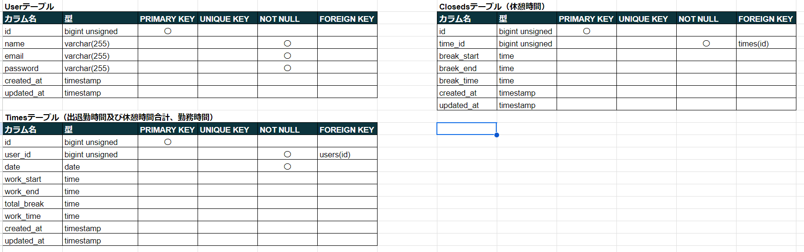
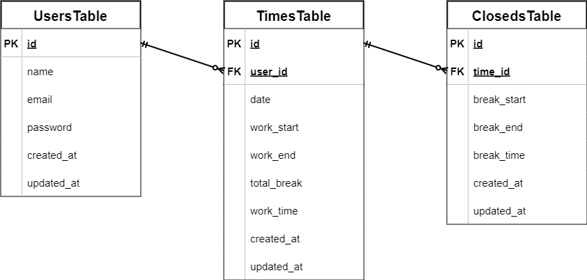

# atte

勤怠管理アプリケーションです。出退勤の登録及び休憩時間を複数回取得してもすべて登録、管理可能です。

## 作成した目的

クライアントから要望のあった機能をすべて持った勤怠管理システムを構築するため作成しました。

## アプリケーションURL

http://localhost

始めにログイン画面が表示されますのでアカウントを作成しログインしてください。

## 機能一覧

・アカウント作成機能

・アカウント作成時のメール認証機能

・ログイン及びログアウト機能

・勤務開始及び終了時間登録機能

・休憩開始及び終了時間登録機能

・日付別勤怠確認機能

・個人別勤怠確認機能

**日付別勤怠確認機能及び個人別勤怠確認機能はページネーションを使用して5件づつの表示となっています。**

## 使用技術

・Laravel 8

・nginx 1.21.1

・php 7.4.9

・html

・css

・mysql 8.0.26

## テーブル設計

## ER図

# 環境構築

### 1 Gitファイルをクローンする

git clone git@github.com:basstuba/atte.git

### 2 Dockerコンテナを作成する

docker-compose up -d --build

### 3 Laravelパッケージをインストールする

docker-compose exec php bash

でPHPコンテナにログインし

composer install

### 4 .envファイルを作成する

PHPコンテナにログインした状態で

cp .env.example .env

作成した.envファイルの該当欄を下記のように変更

DB_HOST=mysql

DB_DATABASE=laravel_db

DB_USERNAME=laravel_user

DB_PASSWORD=laravel_pass

MAIL_MAILER=smtp

MAIL_HOST=mail

MAIL_PORT=1025

MAIL_FROM_ADDRESS=tubatest@gmail.com

MAIL_FROM_NAME="${APP_NAME}"

### 5 src/config/mail.phpの修正

mail.phpファイルの36行目「mailers」からメールの設定があります。
38行目~40行目と95行目~96行目を.envファイルと同じ設定にします。

'transport' => 'smtp',

'host' => env('MAIL_HOST', 'mail'),

'port' => env('MAIL_PORT', 1025),

'address' => env('MAIL_FROM_ADDRESS', 'tubatest@gmail.com'),

'name' => env('MAIL_FROM_NAME', '${APP_NAME}'),

### 6 テーブルの作成

docker-compose exec php bash

でPHPコンテナにログインし(ログインしたままであれば上記コマンドは実行しなくて良いです。)

php artisan migrate

### 7 アプリケーション起動キーの作成

PHPコンテナにログインした状態で

php artisan key:generate

## 補足

新規登録時の認証メールは**MailHog**へ送信されるように設定しています。

URL-> http://localhost:8025

